# City Sim - 軍事シミュレーション システム概要

## 1. システム概要

### 1.1 目的
City Simは、LLM（Large Language Model）を活用した軍事マルチエージェントシミュレーションシステムです。中隊規模（最大100名）のエージェントが、100日間の期間にわたって現実的な軍事環境で行動し、学習し、進化することをシミュレーションします。

### 1.2 主要機能
- **インテリジェントエージェント**: 個性と学習能力を持つ軍事人員の シミュレーション
- **POI（Point of Interest）システム**: 訓練場、食堂、宿舎など、エージェントが相互作用する施設
- **多層メモリシステム**: 時系列メモリ、反射メモリ、空間メモリによる現実的な記憶システム
- **LLM統合**: Gemini 2.0-Flash、Azure OpenAI GPT-4を活用した意思決定
- **高性能データ処理**: Polarsライブラリによる高速な時系列データ処理

### 1.3 技術スタック
- **言語**: Python 3.10+
- **データ処理**: Polars
- **型検証**: Pydantic（設定管理、データ検証）
- **LLM**: Gemini 2.0-Flash, Azure OpenAI GPT-4
- **可視化**: Matplotlib, Plotly
- **テスト**: pytest

## 2. 理論的基盤

### 2.1 カルマンフィルタによる信念更新

システムの核心となる理論の一つは、カルマンフィルタを用いた信念更新メカニズムです。

#### 2.1.1 数学的定義

エージェントがPOI（Point Of Interest: エージェントが行う行為）に対する信念を更新する際、以下の式を使用します。

$$K = \frac{\sigma_b}{\sigma_b + \sigma_o}$$

where:
- $K$: カルマンゲイン（観測をどの程度信頼するか）
- $\sigma_b$: 現在の信念の不確実性（事前分散）
- $\sigma_o$: 観測ノイズ（観測分散、デフォルト: 0.2）

#### 2.1.2 信念更新式

$$\begin{align}
\text{belief}_{\text{updated}} &= K \times \text{observation} + (1 - K) \times \text{belief}_{\text{prior}} \\
\sigma_{\text{updated}} &= (1 - K) \times \sigma_b
\end{align}$$

この式により、以下の3点を実現することができます。
- 観測が信頼できる場合（$\sigma_o$ が小さい）、新しい観測により重みが置かれる
- 事前信念が不確実な場合（$\sigma_b$ が大きい）、観測がより重視される
- 更新後の不確実性は常に減少する

#### 2.1.3 カルマンフィルタ詳細理論

##### 2.1.3.1 ベイズ推定との関係

カルマンフィルタは、**ベイズ推定の特殊ケース**として理解できます。

$$P(\theta|D) = \frac{P(D|\theta) \times P(\theta)}{P(D)}$$

where:
- $P(\theta|D)$: 事後分布（更新後の信念）
- $P(D|\theta)$: 尤度（観測データの確からしさ）
- $P(\theta)$: 事前分布（更新前の信念）
- $P(D)$: 正規化定数

##### 2.1.3.2 ガウス分布の仮定

カルマンフィルタは、**事前分布と尤度が共にガウス分布**であることを仮定します。

$$\begin{align}
P(\theta) &= \mathcal{N}(\mu_b, \sigma_b^2) \quad \text{(事前信念)} \\
P(D|\theta) &= \mathcal{N}(\theta, \sigma_o^2) \quad \text{(観測モデル)}
\end{align}$$

この仮定の下で、事後分布も**ガウス分布**となり、解析的に計算可能です。

##### 2.1.3.3 カルマンフィルタの2段階プロセス

**予測ステップ（Prediction Step）**:
時間経過による不確実性の増加を考慮します。

$$\begin{align}
\hat{\theta}_{t|t-1} &= \hat{\theta}_{t-1|t-1} \quad \text{(状態予測)} \\
\sigma_{t|t-1}^2 &= \sigma_{t-1|t-1}^2 + Q_t \quad \text{(不確実性増加)}
\end{align}$$

**更新ステップ（Update Step）**:
新しい観測データを用いた信念の更新を行います。

$$\begin{align}
K_t &= \frac{\sigma_{t|t-1}^2}{\sigma_{t|t-1}^2 + \sigma_{o,t}^2} \quad \text{(カルマンゲイン)} \\
\hat{\theta}_{t|t} &= \hat{\theta}_{t|t-1} + K_t(z_t - \hat{\theta}_{t|t-1}) \quad \text{(状態更新)} \\
\sigma_{t|t}^2 &= (1 - K_t) \sigma_{t|t-1}^2 \quad \text{(不確実性更新)}
\end{align}$$

##### 2.1.3.4 City Simでの簡略化

本システムでは、**静的環境**を仮定し、予測ステップを省略した簡略版を使用します。

**更新の解釈：**
- **カルマンゲイン $K$ の意味**
  - $K \rightarrow 0$: 観測を信頼せず、事前信念を維持
  - $K \rightarrow 1$: 観測を完全に信頼し、事前信念を破棄
  - $K = 0.5$: 観測と事前信念を等しく重視

- **更新の特性**
  - 観測が信頼できる場合（$\sigma_o$ が小さい）、新しい観測により重みが置かれる
  - 事前信念が不確実な場合（$\sigma_b$ が大きい）、観測がより重視される
  - 更新後の不確実性は**常に減少**する（$\sigma_{\text{updated}} \leq \sigma_b$）

#### 2.1.4 観測値の生成

##### 2.1.4.1 観測モデル

エージェントがPOIを利用した際の**主観的評価**を観測値として生成します。

$$\text{observation} = f(\text{POI effects}, \text{agent state}, \text{context}) + \epsilon$$

where:
- $f(\cdot)$: 効果から主観的評価への変換関数
- $\epsilon \sim \mathcal{N}(0, \sigma_o^2)$: 観測ノイズ

##### 2.1.4.2 信念次元

各POIに対して**4次元の信念ベクトル**を管理します。

```python
belief_dimensions = {
    "satisfaction": "満足度（総合的な満足感）",
    "convenience": "利便性（アクセスしやすさ）", 
    "atmosphere": "雰囲気（環境の快適さ）",
    "effectiveness": "効果性（目的達成度）"
}
```

各次元で独立してカルマンフィルタを適用。

#### 2.1.5 パラメータ調整

##### 2.1.5.1 観測ノイズ $\sigma_o$

```python
# デフォルト値
OBSERVATION_NOISE = 0.2

# 調整指針
# σ_o = 0.1: 観測が非常に信頼できる（迅速な学習）
# σ_o = 0.2: 標準的な信頼度（バランスの取れた学習）
# σ_o = 0.5: 観測が不確実（保守的な学習）
```

##### 2.1.5.2 初期不確実性

```python
# 初期信念の不確実性
INITIAL_BELIEF_SIGMA = 0.3

# 新しいPOIに対する初期値
initial_belief = {
    "satisfaction": 0.5,  # 中立的な初期値
    "convenience": 0.5,
    "atmosphere": 0.5, 
    "effectiveness": 0.5
}
```

#### 2.1.6 システムでの具体的な動作例

##### 2.1.6.1 初回利用時

```python
# 初期状態
belief_prior = 0.5        # 中立的な信念
sigma_prior = 0.3         # 高い不確実性
observation = 0.8         # 良い経験
sigma_obs = 0.2           # 標準的な観測ノイズ

# カルマンゲイン計算
K = 0.3 / (0.3 + 0.2) = 0.6

# 信念更新
belief_updated = 0.6 * 0.8 + 0.4 * 0.5 = 0.68
sigma_updated = 0.4 * 0.3 = 0.12

# 結果：信念が上昇し、不確実性が減少
```

##### 2.1.6.2 複数回利用後

```python
# 2回目利用時
belief_prior = 0.68       # 前回の更新結果
sigma_prior = 0.12        # 低い不確実性
observation = 0.6         # 前回より低い評価
sigma_obs = 0.2

# カルマンゲイン計算
K = 0.12 / (0.12 + 0.2) = 0.375

# 信念更新
belief_updated = 0.375 * 0.6 + 0.625 * 0.68 = 0.65
sigma_updated = 0.625 * 0.12 = 0.075

# 結果：信念が微調整され、さらに不確実性が減少
```

#### 2.1.7 実装の利点と限界

##### 2.1.7.1 利点

1. **理論的保証**: 最小二乗誤差の意味で最適な推定
2. **一貫性**: 観測データが増えるほど真の値に収束
3. **効率性**: 計算量が少なく、リアルタイム処理に適している
4. **個人差の反映**: 各エージェントが独自の信念を形成
5. **学習の自然さ**: 人間の学習過程に近い更新メカニズム
6. **不確実性の管理**: 信頼度を数値化し、意思決定に活用

##### 2.1.7.2 限界

1. **ガウス分布の仮定**: 実際の主観的評価は非ガウス分布の可能性
2. **線形モデル**: 非線形な関係を直接扱えない
3. **独立性の仮定**: 信念次元間の相関を考慮していない
4. **静的環境**: 環境の変化に対する適応が限定的

#### 2.1.8 実装例

```python
def kalman_update(belief: float, sigma_b: float, observation: float, sigma_o: float = 0.2) -> Tuple[float, float]:
    K = sigma_b / (sigma_b + sigma_o)
    updated_belief = K * observation + (1 - K) * belief
    updated_sigma = (1 - K) * sigma_b
    return updated_belief, updated_sigma
```

### 2.2 多層メモリシステム

#### 2.2.1 Temporal Memory（時系列メモリ）

エージェントのすべての行動を時系列順に記録します。

**データスキーマ**:
```json
{
    "id": UUID,
    "time": ISO_timestamp,
    "agent_id": str,
    "poi_id": str,
    "location": [float, float],
    "activity_key": str,
    "observation": {
        "activity": str,
        "poi_id": str,
        "reason": str,
        "expected_duration": int
    },
    "current_energy": float,
    "current_social": float,
    "current_weapon_strength": float,
    "current_hunger": float,
    "current_management_skill": float
}
```

#### 2.2.2 Reflective Memory（反射メモリ）

日次でTemporal Memoryを要約し、高次の行動パターンを抽出します。

**生成プロセス**:
```python
def generate_reflective_summary(df: pl.DataFrame, agent_id: str, date: str) -> dict:
    daily_df = df.filter(
        (pl.col("agent_id") == agent_id) & 
        (pl.col("time").str.contains(date))
    )
    
    summary = {
        "most_visited_poi": most_frequent_poi(daily_df),
        "avg_energy": daily_df["current_energy"].mean(),
        "skill_changes": calculate_skill_changes(daily_df),
        "activity_patterns": analyze_activity_patterns(daily_df)
    }
    
    return summary
```

#### 2.2.3 Spatial Memory（空間メモリ）

各POIに対する「信念ベクトル」を管理し、エージェントの経験に基づいて更新します。

**信念ベクトル**:
```python
belief_vector = {
    "satisfaction": float,    # 満足度
    "convenience": float,     # 利便性
    "atmosphere": float,      # 雰囲気
    "effectiveness": float    # 効果性
}
```

### 2.3 需要ベースの行動選択

エージェントの行動は、以下の需要パラメータに基づいて決定されます。

#### 2.3.1 需要パラメータ

- **Energy**: エネルギー（0.0-1.0）
- **Hunger**: 空腹度（0.0-1.0）
- **Social**: 社会的欲求（0.0-1.0）
- **Weapon Strength**: 武器技能（0.0-1.0）
- **Management Skill**: 管理技能（0.0-1.0）

#### 2.3.2 需要更新式

**エネルギー減少**

$$\text{energy}_{\text{decay}} = 0.05 \times \Delta t \times \mathcal{U}(0.8, 1.2)$$

$$\text{energy}_{\text{new}} = \max(0.0, \text{energy}_{\text{current}} - \text{energy}_{\text{decay}})$$

**空腹度増加**

$$\text{hunger}_{\text{increase}} = 0.08 \times \Delta t \times \mathcal{U}(0.8, 1.2)$$

$$\text{hunger}_{\text{new}} = \min(1.0, \text{hunger}_{\text{current}} + \text{hunger}_{\text{increase}})$$

**社会的欲求変化**
$$\text{social}_{\text{change}} = 0.03 \times \Delta t \times \text{personality}_{\text{factor}}$$

$$\text{social}_{\text{new}} = \max(0.0, \min(1.0, \text{social}_{\text{current}} - \text{social}_{\text{change}}))$$

where:
- $\Delta t$: 時間変化量（デフォルト: 1.0）
- $\mathcal{U}(0.8, 1.2)$: 0.8から1.2までの一様分布による個人差
- $\text{personality}_{\text{factor}}$: 性格による係数

#### 2.3.3 収穫逓減効果

POIの効果は収穫逓減の法則に従います。

```python
def apply_effect_with_diminishing_returns(self, attribute: str, effect: float, cap: float = 1.0) -> None:
    current = getattr(self, attribute)
    
    if effect > 0:
        # 上限に近づくほど効果が減少
        distance_to_cap = cap - current
        diminish_factor = distance_to_cap / cap
        random_factor = random.uniform(0.8, 1.2)
        new_value = current + (effect * diminish_factor * random_factor)
    else:
        # 負の効果は現在値に比例
        diminish_factor = current / cap
        random_factor = random.uniform(0.8, 1.2)
        new_value = current + (effect * diminish_factor * random_factor)
    
    setattr(self, attribute, max(0.0, min(cap, new_value)))
```

### 2.4 構造化出力（Structured Output）

LLMからの出力は、Pydanticモデルによって型安全に検証されます。

#### 2.4.1 計画出力スキーマ

```python
class PlanOutput(BaseModel):
    agent_id: str = Field(..., description="エージェントの一意なID")
    chosen_poi: str = Field(..., description="次に訪問するPOIのID")
    activity: Literal["train", "eat", "rest", "manage", "arm"] = Field(..., description="実施するアクティビティ")
    expected_duration: int = Field(..., ge=1, le=8, description="活動予定時間（時間単位）")
    reason: str = Field(..., description="行動選択の理由")
```

## 3. 処理フロー

### 3.1 システム全体の処理フローMermaid図

```mermaid
flowchart TD
    %% メインフロー
    start([開始]) --> loadSettings[1 設定読み込み]
    loadSettings --> loadConfig[2 設定ファイル読み込み]
    loadSettings --> loadAgents[3 エージェント初期化]
    loadAgents --> loadPOIs[4 POI初期化]
    loadConfig --> initLLM[5 LLMクライアント初期化]
    initLLM --> initPlanner[6 プランナー初期化]
    
    initPlanner --> dayLoop[7 日次ループ開始<br>（simulation_days）]
    dayLoop --> endDay[8 前日の処理完了]
    endDay --> updateRefMem[9 日次反射メモリ更新]
    
    updateRefMem --> stepLoop[10 時間ステップループ開始<br>（time_steps_per_day）]
    stepLoop --> agentIter[11 エージェントループ開始]
    
    %% エージェント処理シーケンス
    agentIter --> updateNeeds[12 需要更新<br>（エネルギー減少、空腹増加等）]
    updateNeeds --> checkLLM{13 LLMを使用?}
    
    %% 行動計画分岐
    checkLLM -->|Yes| llmPlan[14a LLMプランナー]
    llmPlan --> buildPrompt[15a プロンプト構築]
    buildPrompt --> invokeLLM[16a LLM呼び出し]
    invokeLLM --> validateOutput[17a 構造化出力検証]
    validateOutput --> returnPlan[18a 計画決定]
    
    checkLLM -->|No| rulePlan[14b ルールベース計画]
    rulePlan --> checkHunger{15b 空腹度 > 0.7?}
    checkHunger -->|Yes| findFood[16b 食事POI探索]
    checkHunger -->|No| checkEnergy{17b エネルギー < 0.3?}
    checkEnergy -->|Yes| findRest[18b 休憩POI探索]
    checkEnergy -->|No| findTrain[19b 訓練POI探索]
    findFood --> returnRulePlan[20b 計画決定]
    findRest --> returnRulePlan
    findTrain --> returnRulePlan
    
    %% 行動実行と効果
    returnPlan --> execAction[19 行動実行]
    returnRulePlan --> execAction
    execAction --> applyEffects[20 POI効果適用]
    
    %% 信念更新プロセス
    applyEffects --> genObs[21 観測データ生成]
    genObs --> forDims[22 各信念次元処理]
    forDims --> kalmanCalc[23 カルマンゲイン計算<br>K = σ_b/（σ_b+σ_o）]
    kalmanCalc --> beliefUpd[24 信念更新<br>b_new = K×観測 + （1-K）×b_prior]
    beliefUpd --> sigmaUpd[25 不確実性更新<br>σ_new = （1-K）×σ_b]
    
    %% メモリ記録処理
    sigmaUpd --> recordTemp[26 時系列メモリ記録]
    recordTemp --> checkBuffer{27 バッファ<br>サイズ >= 100?}
    checkBuffer -->|Yes| flushBuffer[28 バッファをDFに変換]
    checkBuffer -->|No| checkNextAgent[29 次エージェント確認]
    flushBuffer --> checkNextAgent
    
    %% エージェントと時間ステップのループ
    checkNextAgent{全エージェント<br>処理完了?} -->|No| agentIter
    checkNextAgent -->|Yes| advanceTime[30 時間進行]
    advanceTime --> checkStepEnd{31 全時間ステップ<br>完了?}
    checkStepEnd -->|No| stepLoop
    checkStepEnd -->|Yes| genDailySummary[32 日次サマリー生成]
    
    %% 日次ループの完了確認
    genDailySummary --> checkDayEnd{33 全日程完了?}
    checkDayEnd -->|No| dayLoop
    checkDayEnd -->|Yes| exitSim[34 シミュレーション完了]
    
    %% データ出力フェーズ
    exitSim --> saveLog[35 ログ出力]
    saveLog --> saveTemp[36 時系列メモリ保存]
    saveTemp --> saveReflective[37 反射メモリ保存]
    saveReflective --> genAnalysis[38 分析用データ生成]
    
    %% 分析データ生成
    genAnalysis --> skillGrowth[39 スキル成長分析]
    skillGrowth --> poiUsage[40 POI使用統計]
    poiUsage --> timeSeries[41 時系列分析]
    timeSeries --> finish([終了])
    
    %% スタイル設定
    classDef init fill:#d4f1f9,stroke:#05b2dc
    classDef simulation fill:#d9d2e9,stroke:#8e7cc3
    classDef agent fill:#d9ead3,stroke:#93c47d
    classDef planning fill:#fce5cd,stroke:#f6b26b
    classDef memory fill:#fff2cc,stroke:#ffce43
    classDef output fill:#f4cccc,stroke:#e06666
    
    class loadSettings,loadConfig,loadAgents,loadPOIs,initLLM,initPlanner init
    class dayLoop,endDay,stepLoop,advanceTime,checkDayEnd,checkStepEnd,updateRefMem simulation
    class agentIter,updateNeeds,execAction,applyEffects agent
    class checkLLM,llmPlan,buildPrompt,invokeLLM,validateOutput,returnPlan,rulePlan,checkHunger,checkEnergy,findFood,findRest,findTrain,returnRulePlan planning
    class genObs,forDims,kalmanCalc,beliefUpd,sigmaUpd,recordTemp,checkBuffer,flushBuffer memory
    class exitSim,saveLog,saveTemp,saveReflective,genAnalysis,skillGrowth,poiUsage,timeSeries output
```



### 3.2 メイン処理ループ

```python
for day in range(simulation_days):
    # 1. 日次反射メモリ更新
    update_reflective_memory()
    
    for step in range(time_steps_per_day):
        # 2. 全エージェントの需要更新
        for agent in agents:
            agent.update_needs(time_delta=1.0)
        
        # 3. 行動計画
        for agent in agents:
            action = planner.plan_action(
                agent_state=agent.to_dict(),
                reflective_memory=memory.get_reflective_memory(agent.id),
                poi_list=[poi.to_dict() for poi in pois]
            )
            
            # 4. 行動実行
            execute_action(agent, action)
            
            # 5. POI効果適用
            apply_poi_effects(agent, action)
            
            # 6. 信念更新
            update_poi_beliefs(agent, action)
            
            # 7. メモリ記録
            memory.record_action(agent, current_time, poi, action)
        
        # 8. 時間進行
        advance_time()
    
    # 9. 日次サマリー生成
    generate_daily_summaries()
```

### 3.2 LLMプランナー統合

```python
class Planner:
    def plan_action(self, agent_state: Dict, reflective_memory: Dict, poi_list: List[Dict]) -> PlanOutput:
        # プロンプト構築
        prompt = self._build_prompt(agent_state, reflective_memory, poi_list)
        
        # LLM呼び出し
        result = self.llm.invoke_with_structured_output(
            system_prompt=SYSTEM_PROMPT,
            user_prompt=prompt,
            json_structure=PlanOutput.model_json_schema()
        )
        
        # Pydantic検証
        return PlanOutput(**result)
```

## 4. アーキテクチャ

### 4.1 モジュール構成

```
src/
├── agent_system/           # エージェントシステム
│   ├── agent.py           # エージェント実装
│   ├── poi.py             # POI管理
│   ├── kalman.py          # カルマンフィルタ
│   ├── memory.py          # メモリシステム
│   └── simulation.py      # シミュレーション実行
├── llm_app/               # LLM統合
│   ├── client_gemini.py   # Geminiクライアント
│   ├── client_azure.py    # Azureクライアント
│   ├── planner.py         # プランナー
│   └── schemas.py         # Pydanticスキーマ
├── configs/               # 設定管理
│   └── settings.py        # 環境設定
└── utils/                 # ユーティリティ
    └── df_utils.py        # Polarsヘルパー
```

### 4.2 データフロー

1. **設定読み込み**: YAML設定ファイルから初期パラメータを読み込み
2. **エージェント初期化**: JSON形式のペルソナデータからエージェントを生成
3. **POI初期化**: JSON形式のPOIデータから施設を生成
4. **シミュレーション実行**: 時系列ループによる行動シミュレーション
5. **データ出力**: Parquet形式でのデータ保存、JSON形式でのログ出力

## 5. 技術的特徴

### 5.1 高性能データ処理

- **Polars**: Rustベースの高速データフレームライブラリ
- **並列処理**: 大規模データセットの効率的な処理
- **メモリ効率**: 最適化されたメモリ使用量

### 5.2 型安全性

- **Pydantic**: 実行時の型検証とデータ検証
- **環境変数管理**: 型安全な設定管理
- **構造化出力**: LLMからの出力の型安全な検証

### 5.3 拡張性

- **モジュラー設計**: 機能別のモジュール分割
- **LLMプロバイダー抽象化**: 複数のLLMサービスに対応
- **設定駆動**: YAML設定による柔軟なパラメータ調整

## 6. 出力データ

### 6.1 生成されるファイル

- **logs.json**: シミュレーション実行ログ
- **temporal_memory.parquet**: 時系列メモリデータ（高速アクセス用）
- **reflective_memory.json**: 反射メモリサマリー

### 6.2 分析機能

- **時系列分析**: エージェントの行動パターン分析
- **POI使用状況**: 施設利用の統計分析
- **スキル成長**: 技能向上の追跡
- **可視化**: Matplotlib/Plotlyによるグラフ生成

## 7. 今後の拡張予定

### 7.1 高度な機能

- **階層的プランニング**: 長期・短期目標の統合
- **チーム行動**: 複数エージェントによる協調行動
- **動的環境**: 時間とともに変化する環境パラメータ
- **リアルタイム可視化**: WebUIによるリアルタイム監視

### 7.2 最適化

- **分散処理**: 大規模シミュレーション対応
- **GPU加速**: 数値計算の高速化
- **データベース統合**: 大規模データの永続化

## 8. 使用例

### 8.1 基本実行

```bash
# 基本シミュレーション
python main.py

# 設定ファイル指定
python main.py --config configs/production.yaml

# パラメータ指定
python main.py --days 30 --agents 50 --pois 15
```

### 8.2 分析例

```python
import polars as pl

# 時系列メモリ読み込み
df = pl.read_parquet("output/temporal_memory.parquet")

# エージェント別スキル成長分析
skill_growth = df.groupby("agent_id").agg([
    pl.col("current_weapon_strength").last() - pl.col("current_weapon_strength").first(),
    pl.col("current_management_skill").last() - pl.col("current_management_skill").first()
])

# POI使用頻度分析
poi_usage = df.groupby("poi_id").count().sort("count", descending=True)
```

この システムにより、現実的で複雑な軍事シミュレーション環境での意思決定プロセスを詳細に分析し、理解することが可能になります。
